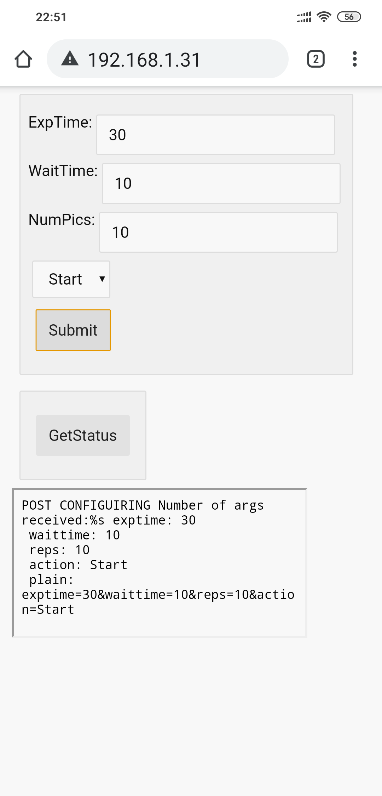
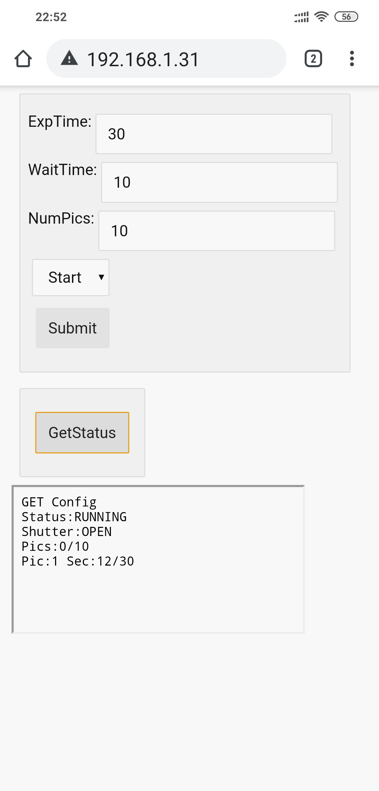

# ESP8266AstrophotographyIntervalometer
An Astrophotography Intervalometer using an ESP8266 and a relay, configured using a ESP8266 Web Server

The reason I use a relay is to keep the camera electrically isolated from the controller, just in case... 

PinOuts of the different camera manufacturers for the 2.5mm jack of the release
http://www.doc-diy.net/photo/remote_pinout/

Got the body of the esp8266 web server from here
https://mancusoa74.blogspot.com/2018/02/simple-http-rest-server-on-esp8266.html

## Version 1 - Proof of Concept - Hacking it together with whatever I had.
ESP8266 - 
https://www.banggood.com/Upgraded-Version-1M-Flash-ESP8266-ESP-01-WIFI-Transceiver-Wireless-Module-p-979509.html?rmmds=search&cur_warehouse=CN  

ESP-01S Relay Module that I used - broken out-of-the-box
https://www.banggood.com/ESP8266-ESP01-WIFI-Transceiver-Wireless-Module-USB-To-ESP8266-Serial-Adapter-Wireless-WIFI-Develoment-Board-p-1408866.html?rmmds=search&cur_warehouse=CN
  
How to fix the cheap ESP-01S ESP8266 relay modules - https://www.youtube.com/watch?v=Uq7ZfutOSSg 

Single cell BMS for power
https://www.banggood.com/5-Pcs-TP4056-Micro-USB-5V-1A-Lithium-Battery-Charging-Module-Board-TE585-Lipo-Charger-p-1255762.html?rmmds=search&cur_warehouse=CN

## Version 2 - nicer setup with plug together components
Wemos D1 Mini base Build Bill Of Materials  
Controller - https://grobotronics.com/wemos-d1-mini-pro-esp8266-v1.0.html  
Battery Shield - https://grobotronics.com/wemos-d1-mini-battery-shield.html  
Relay Shield - https://grobotronics.com/wemos-d1-mini-relay-shield.html  
Battery - https://grobotronics.com/polymer-lithium-ion-battery-3.7v-1200mah.html  

Additionally you need a 2.5mm female jack and some wire.

  

## Usage
Once you turn on the Wemos, it will try to connect to a network with:  
SSID: wewewe
PASS: 1qazxsw2    
  
If it cannot connect to the network  within 10 seconds, then it will start an access point with:  
SSID: ESP8266Astro
PASS: 1qazxsw2  

Of course you can edit the code and change these things.  

So either you connect your smartphone to the same wifi AP or connect to the initiated access point. 
In order to access the control page, type http://esp8266astro to a Bonjour enabled browser or download BonjourBrowers on your Android device (https://play.google.com/store/apps/details?id=de.wellenvogel.bonjourbrowser)  

Once you connect to the webpage, insert values for Exposure, between photos wait time and number of pics, select Start from the drop down menu and press submit. If you want to stop, select Stop from the drop down menu and press Submit. 

  

If you want to see what the status of photo taking is, press the GetStatus button.  

  
I put everything in a box to make it more secure. 

